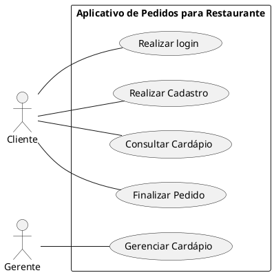
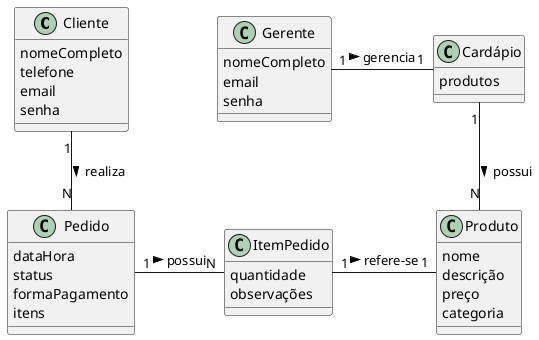
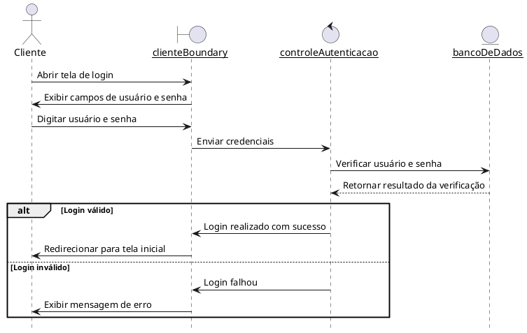
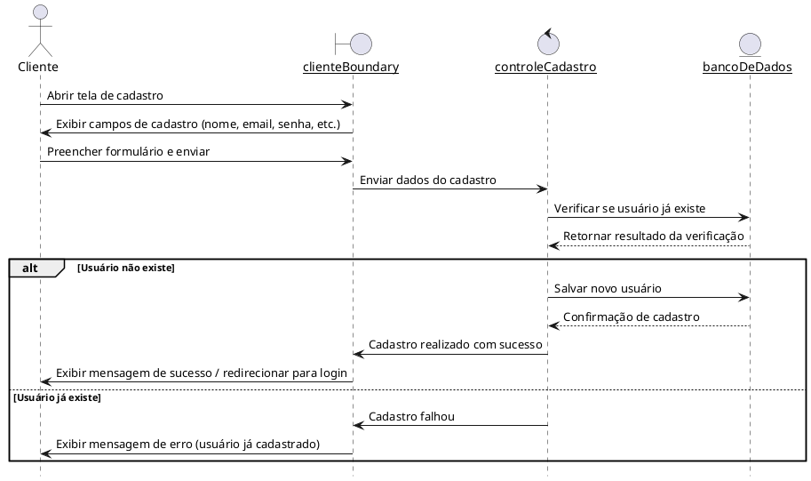
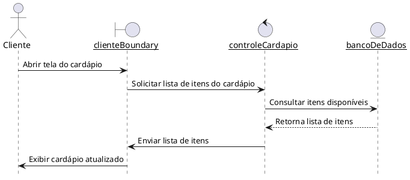
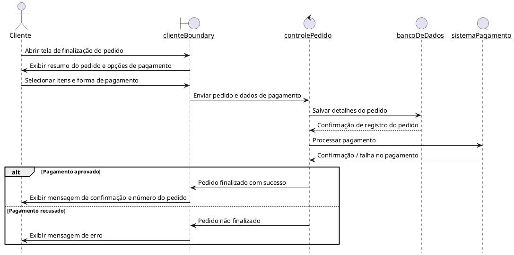
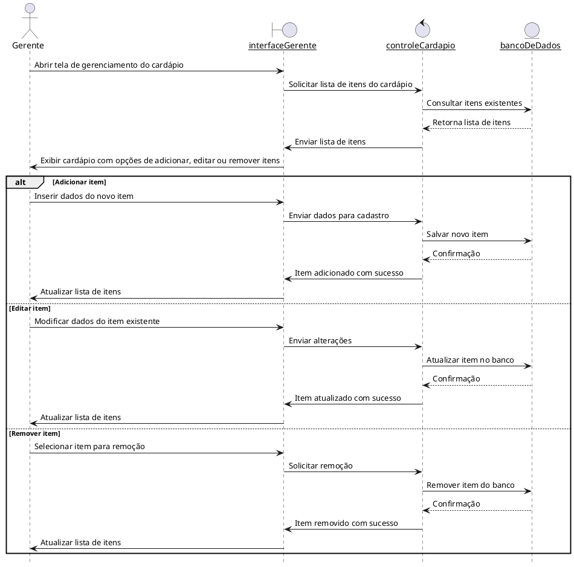

# Aplicativo de Pedidos Para Restaurante

O Aplicativo de Pedidos para Restaurante é uma solução digital desenvolvida para otimizar a experiência de clientes e facilitar a gestão de restaurantes. Com ele, os clientes podem visualizar o cardápio atualizado, fazer pedidos diretamente pelo smartphone e realizar pagamentos de forma prática e segura. Para os atendentes e gerentes, o sistema oferece controle dos pedidos em tempo real, atualização de cardápio, tornando o processo mais ágil, organizado e eficiente.

## 1. Diagrama de Casos de Uso

## 2. Descrições dos Casos de Uso

### 2.1. Realizar login (CDU001)
**Resumo:** Para conseguir acessar o cardápio e fazer os pedidos, primeiro o cliente deverá realizar o login com e-mail e senha. Caso seja o primeiro acesso, pode ser realizado o cadastro.

**Ator Principal:** Cliente

**Pré-condições:** Nenhuma

**Pós-condições:** O cliente está registrado no site e consegue acessar o cardápio para realizar o pedido.

#### Fluxo Principal

1. O sistema solicita e-mail e senha para o login.
2. O cliente fornece os dados.
3. O sistema verifica se o e-mail e senha estão corretos.
4. O sistema libera o acesso ao cardápio.

#### Fluxo de Exceção

##### Passo 3 (e-mail e senha estão incorretos)
O sistema verifica que o e-mail ou senha nãoo condizem com o que foi cadastrado e solicita que o cliente tente novamente. O caso de uso retorna para o passo 1 do fluxo principal.

## 2.2. Realizar Cadastro (CDU002)
**Resumo:** Permite que novos clientes criem uma conta no aplicativo fornecendo informações básicas como nome, e-mail, senha e telefone.

**Ator Principal:** Cliente

**Pré-condições:** O cliente ainda não possui cadastro no aplicativo.

**Pós-condições:** O cliente está registrado no sistema e pode realizar login para acessar o cardápio e fazer pedidos.

#### Fluxo Principal

1. O cliente seleciona a opção "Cadastrar-se".
2. O sistema solicita informações pessoais: nome completo, e-mail, senha e telefone.
3. O cliente preenche os dados e confirma o cadastro.
4. O sistema valida os dados e registra o cliente no banco de dados.
5. O sistema confirma que o cadastro foi realizado com sucesso.

#### Fluxo de Exceção

##### Passo 4 (e-mail já existente):
O sistema verifica que o e-mail informado já está cadastrado e solicita que o cliente use outro e-mail ou realize login.

## 2.3. Consultar cardápio (CDU003)
**Resumo:** Permite que o cliente visualize todos os itens do cardápio, com descrições, preços e categorias.

**Ator Principal:** Cliente

**Pré-condições:** O cliente deve estar logado no aplicativo.

**Pós-condições:** O cliente visualiza o cardápio atualizado e pode selecionar produtos para adicionar ao pedido.

#### Fluxo Principal

1. O cliente acessa a opção "Cardápio".

2. O sistema apresenta todos os itens disponíveis, divididos por categorias.

3. O cliente navega pelo cardápio e seleciona produtos de interesse.

#### Fluxo de Exceção

##### Passo 2 (falha na conexão ou cardápio indisponível):
O sistema exibe uma mensagem de erro e solicita que o cliente tente novamente mais tarde.

## 2.4. Finalizar pedido (CDU004)
**Resumo:** Permite que o cliente selecione produtos do cardápio, configure opções adicionais, revise o pedido e finalize o pagamento.

**Ator Principal:** Cliente

**Pré-condições:** O cliente deve estar logado e ter itens adicionados ao carrinho.

**Pós-condições:** O pedido é registrado no sistema, enviado para a cozinha e confirmado ao cliente.

#### Fluxo Principal

1. O cliente adiciona itens ao carrinho.

2. O cliente revisa os itens e seleciona formas de pagamento e entrega.

3. O cliente confirma o pedido.

4. O sistema processa o pagamento e registra o pedido.

5. O sistema envia a confirmação do pedido ao cliente e para a equipe do restaurante.

#### Fluxo de Exceção

##### Passo 4 (pagamento não autorizado):
O sistema informa que o pagamento não foi autorizado e solicita que o cliente tente outro método de pagamento. O caso de uso retorna para o passo 2 do fluxo principal.

## 2.5. Gerenciar cardápio (CDU005)
**Resumo:** Permite que o gerente do restaurante adicione, edite ou remova itens do cardápio, mantendo as informações atualizadas.

**Ator Principal:** Gerente

**Pré-condições:** O gerente deve estar autenticado no sistema.

**Pós-condições:** O cardápio é atualizado e os clientes visualizam as alterações em tempo real.

#### Fluxo Principal

1. O gerente acessa a opção "Gerenciar Cardápio".

2. O sistema exibe todos os itens existentes e opções para adicionar, editar ou remover produtos.

3. O gerente realiza as alterações desejadas.

4. O sistema valida e atualiza o cardápio no banco de dados.

5. O sistema confirma que o cardápio foi atualizado com sucesso.

#### Fluxo de Exceção

##### Passo 4 (erro de validação ou banco de dados):
O sistema exibe uma mensagem de erro e solicita que o gerente tente novamente. O caso de uso retorna para o passo 2 do fluxo principal.

## 3. Modelo de domínio

## 4. Diagramas de sequência

### 4.1. Realizar login (CDU001)

### 4.2. Realizar cadastro (CDU002)

### 4.3. Consultar cardápio (CDU003)

### 4.4. Finalizar pedido (CDU004)

### 4.5. Gerenciar cardápio (CDU005)

